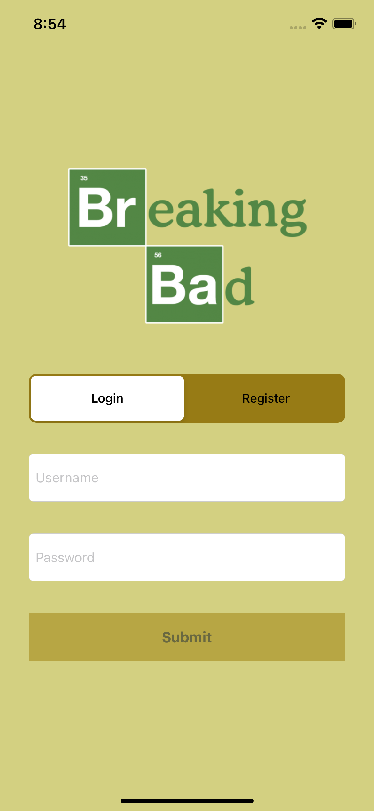
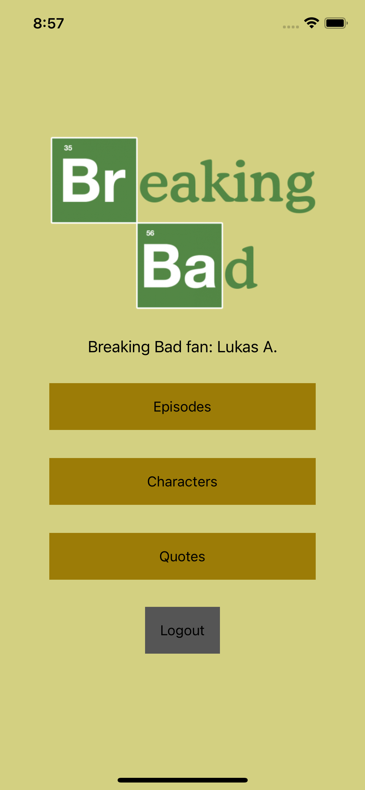
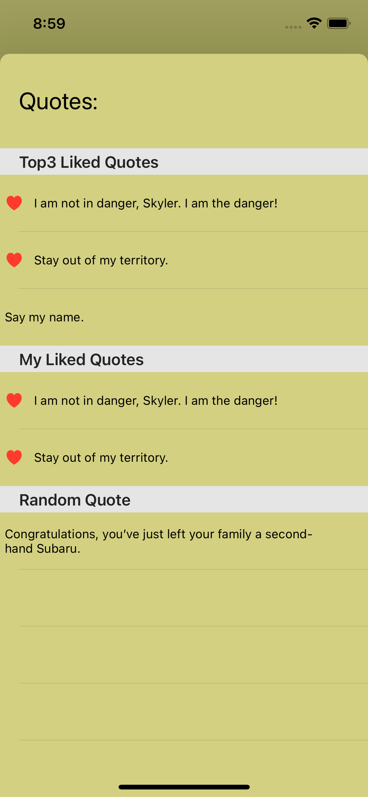
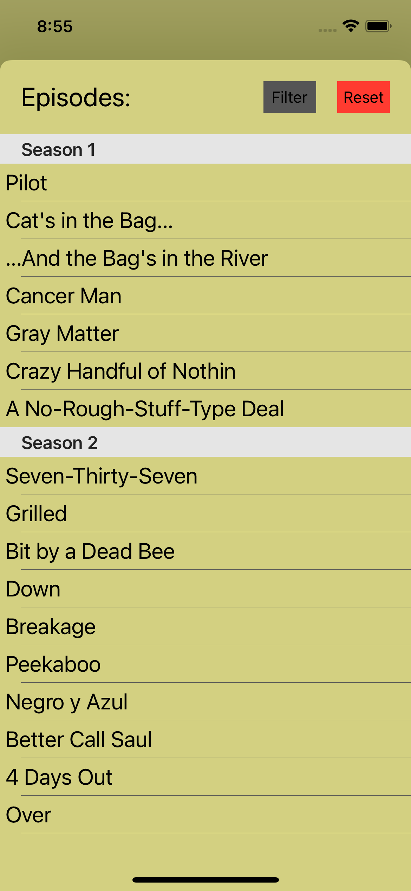

# CodeAcademy-take-home-project-1
Breaking Bad Trivia app

In this project you will be making a Breaking Bad Fan iOS application. The goal is to demonstrate the skills and principles you learned in the first part of the course.

The main idea of Breaking Bad Fan iOS application is to allow users to explore episodes and characters of the show. Save and see favorite quotes of other users of the application.

Details of each scene will be provided. Some are stricter and some allow for flexibility and choices. Every corner case of this application is not described and you should follow principles described in the “General” section and follow good practices that we talked about during our classes.

Mockups of some views are provided as well. They show general ideas of views but give you flexibility to decide on fonts, colors, sizes, spacing, namings and other design characteristics. More broader requirements of design can be found in the “UI” section.

This application uses Breaking Bad API, documentation can be found @ https://breakingbadapi.com.
It is part of the task to understand which API endpoints to use to fulfil the requirements.

